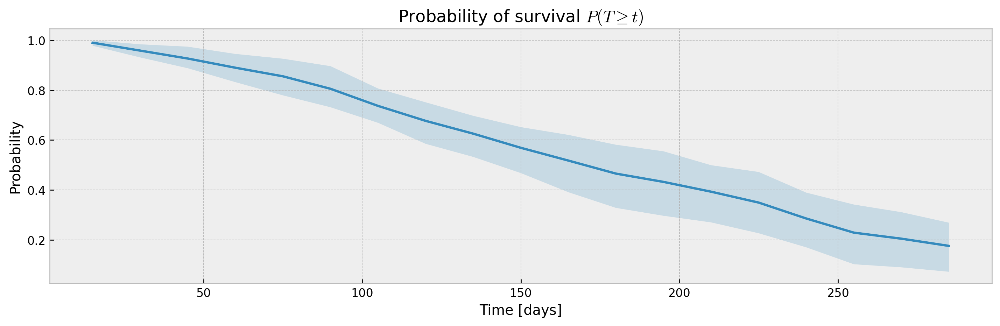
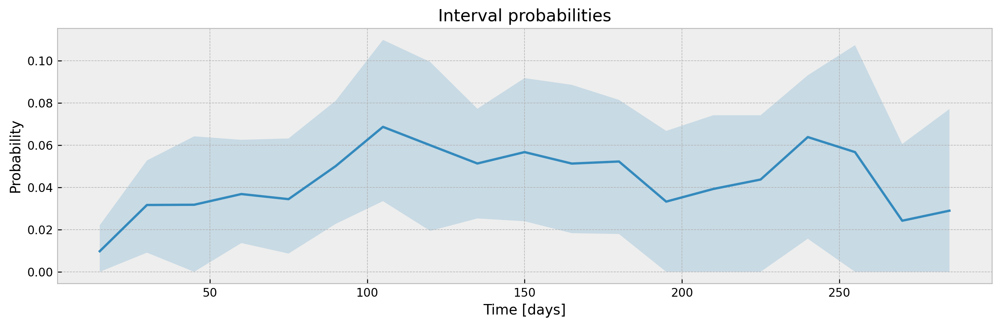
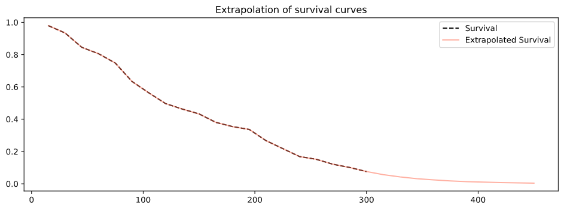
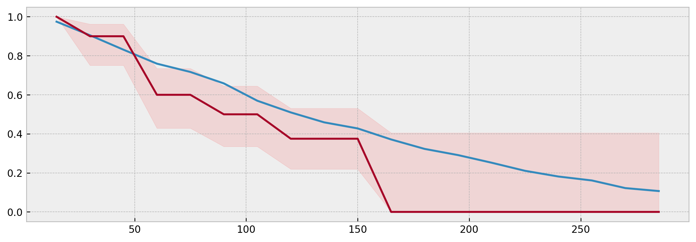

## `xgbse`: XGBoost Survival Embeddings

> *"There are two cultures in the use of statistical modeling to reach conclusions from data. One assumes that the data are generated by a given stochastic data model. The other uses algorithmic models and treats the data mechanism as unknown."* - Leo Breiman, [Statistical Modeling: The Two Cultures](https://projecteuclid.org/euclid.ss/1009213726)

Survival Analysis is a powerful statistical technique with a wide range of applications such as predictive maintenance, customer churn, credit risk, asset liquidity risk, and others.

However, it has not yet seen widespread adoption in industry, with most implementations embracing one of two cultures:

1. models with sound statistical properties, but lacking in expressivess and computational efficiency
2. highly efficient and expressive models, but lacking in statistical rigor

`xgbse` aims to unite the two cultures in a single package, adding a layer of statistical rigor to the highly expressive and computationally effcient `xgboost` survival analysis implementation.

The package offers:

* calibrated and unbiased survival curves with confidence intervals (instead of point predictions)
* great predictive power, competitive to vanilla `xgboost`
* efficient, easy to use implementation
* explainability through prototypes

This is a research project by [Loft Data Science Team](https://medium.com/loftbr/datascience/home), however we invite the community to contribute. Please help by trying it out, reporting bugs, and letting us know what you think!

## [TODO] Installation

...

## Usage

### *Basic usage*

The package follows `scikit-learn` API, with a minor adaptation to work with time and event data (`y` as a `numpy` structured array of times and events). `.predict()` returns a dataframe where each column is a time window and values represent the probability of survival before or exactly at the time window.

```python
# importing dataset from pycox package
from pycox.datasets import metabric

# importing model and utils from xgbse
from xgbse import XGBEmbedKaplanNeighbors
from xgbse.converters import convert_to_structured

# getting data
df = metabric.read_df()

# splitting to X, y format
X = df.drop(['duration', 'event'], axis=1)
y = convert_to_structured(df['duration'], df['event'])

# fitting xgbse model
xgbse_model = XGBEmbedKaplanNeighbors(n_neighbors=50)
xgbse_model.fit(X, y)

# predicting
event_probs = xgbse_model.predict(X)
event_probs.head()
```

index | 15 | 30 | 45 | 60 | 75 | 90 | 105 | 120 | 135 | 150 | 165 | 180 | 195 | 210 | 225 | 240 | 255 | 270 | 285
---- | ---- | ---- | ---- | ---- | ---- | ---- | ---- | ---- | ---- | ---- | ---- | ---- | ---- | ---- | ---- | ---- | ---- | ---- | ----
0 | 0.98 | 0.87 | 0.81 | 0.74 | 0.71 | 0.66 | 0.53 | 0.47 | 0.42 | 0.4 | 0.3 | 0.25 | 0.21 | 0.16 | 0.12 | 0.098 | 0.085 | 0.062 | 0.054
1 | 0.99 | 0.89 | 0.79 | 0.7 | 0.64 | 0.58 | 0.53 | 0.46 | 0.42 | 0.39 | 0.33 | 0.31 | 0.3 | 0.24 | 0.21 | 0.18 | 0.16 | 0.11 | 0.095
2 | 0.94 | 0.78 | 0.63 | 0.57 | 0.54 | 0.49 | 0.44 | 0.37 | 0.34 | 0.32 | 0.26 | 0.23 | 0.21 | 0.16 | 0.13 | 0.11 | 0.098 | 0.072 | 0.062
3 | 0.99 | 0.95 | 0.93 | 0.88 | 0.84 | 0.81 | 0.73 | 0.67 | 0.57 | 0.52 | 0.45 | 0.37 | 0.33 | 0.28 | 0.23 | 0.19 | 0.16 | 0.12 | 0.1
4 | 0.98 | 0.92 | 0.82 | 0.77 | 0.72 | 0.68 | 0.63 | 0.6 | 0.57 | 0.55 | 0.51 | 0.48 | 0.45 | 0.42 | 0.38 | 0.33 | 0.3 | 0.22 | 0.2

You can also get interval predictions (probability of failing exactly at each time window) using `return_interval_probs`:

```python
# point predictions
interval_probs = xgbse_model.predict(X_valid, return_interval_probs=True)
interval_probs.head()
```

index | 15 | 30 | 45 | 60 | 75 | 90 | 105 | 120 | 135 | 150 | 165 | 180 | 195 | 210 | 225 | 240 | 255 | 270 | 285
---- | ---- | ---- | ---- | ---- | ---- | ---- | ---- | ---- | ---- | ---- | ---- | ---- | ---- | ---- | ---- | ---- | ---- | ---- | ----
0 | 0.024 | 0.1 | 0.058 | 0.07 | 0.034 | 0.05 | 0.12 | 0.061 | 0.049 | 0.026 | 0.096 | 0.049 | 0.039 | 0.056 | 0.04 | 0.02 | 0.013 | 0.023 | 0.0078
1 | 0.014 | 0.097 | 0.098 | 0.093 | 0.052 | 0.065 | 0.054 | 0.068 | 0.034 | 0.038 | 0.053 | 0.019 | 0.018 | 0.052 | 0.038 | 0.027 | 0.018 | 0.05 | 0.015
2 | 0.06 | 0.16 | 0.15 | 0.054 | 0.033 | 0.053 | 0.046 | 0.073 | 0.032 | 0.014 | 0.06 | 0.03 | 0.017 | 0.055 | 0.031 | 0.016 | 0.014 | 0.027 | 0.0097
3 | 0.011 | 0.034 | 0.021 | 0.053 | 0.038 | 0.038 | 0.08 | 0.052 | 0.1 | 0.049 | 0.075 | 0.079 | 0.037 | 0.052 | 0.053 | 0.041 | 0.026 | 0.04 | 0.017
4 | 0.016 | 0.067 | 0.099 | 0.046 | 0.05 | 0.042 | 0.051 | 0.028 | 0.03 | 0.018 | 0.048 | 0.022 | 0.029 | 0.038 | 0.035 | 0.047 | 0.031 | 0.08 | 0.027


### *Survival curves and confidence intervals*

`XBGSEKaplanTree` and `XBGSEKaplanNeighbors` support estimation of survival curves and confidence intervals via the Exponential Greenwood formula out-of-the-box via the `return_ci` argument:

```python
# fitting xgbse model
xgbse_model = XGBSEKaplanNeighbors(n_neighbors=50)
xgbse_model.fit(X_train, y_train, time_bins=TIME_BINS)

# predicting
mean, upper_ci, lower_ci = xgbse_model.predict(X_valid, return_ci=True)

# plotting CIs
plot_ci(mean, upper_ci, lower_ci)
```


`XGBSEDebiasedBCE` does not support estimation of confidence intervals out-of-the-box, but we provide the `XGBSEBootstrapEstimator` to get non-parametric confidence intervals. As the stacked logistic regressions are trained with more samples (in comparison to neighbor-sets in `XGBSEKaplanNeighbors`), confidence intervals are more concentrated:

```python
# base model as BCE
base_model = XGBSEDebiasedBCE(PARAMS_XGB_AFT, PARAMS_LR)

# bootstrap meta estimator
bootstrap_estimator = XGBSEBootstrapEstimator(base_model, n_estimators=20)

# fitting the meta estimator
bootstrap_estimator.fit(
    X_train,
    y_train,
    validation_data=(X_valid, y_valid),
    early_stopping_rounds=10,
    time_bins=TIME_BINS,
)

# predicting
mean, upper_ci, lower_ci = bootstrap_estimator.predict(X_valid, return_ci=True)

# plotting CIs
plot_ci(mean, upper_ci, lower_ci)
```


The bootstrap abstraction can be used for `XBGSEKaplanTree` and `XBGSEKaplanNeighbors` as well, however, the confidence interval will be estimated via bootstrap only (not Exponential Greenwood formula):

```python
# base model
base_model = XGBSEKaplanTree(PARAMS_TREE)

# bootstrap meta estimator
bootstrap_estimator = XGBSEBootstrapEstimator(base_model, n_estimators=100)

# fitting the meta estimator
bootstrap_estimator.fit(
    X_train,
    y_train,
    time_bins=TIME_BINS,
)

# predicting
mean, upper_ci, lower_ci = bootstrap_estimator.predict(X_valid, return_ci=True)

# plotting CIs
plot_ci(mean, upper_ci, lower_ci)
```



With a sufficiently large `n_estimators`, interval width shouldn't be much different, with the added benefit of model stability and improved accuracy. Addittionaly, `XGBSEBootstrapEstimator` allows building confidence intervals for interval probabilities (which is not supported for Exponential Greenwood):

```python
# predicting
mean, upper_ci, lower_ci = bootstrap_estimator.predict(
    X_valid,
    return_ci=True,
    return_interval_probs=True
)

# plotting CIs
plot_ci(mean, upper_ci, lower_ci)
```



The parameter `ci_width` controls the width of the confidence interval. For `XGBSEKaplanTree` it should be passed at `.fit()`, as KM curves are pre-calculated for each leaf at fit time to avoid storing training data.

```python
# fitting xgbse model
xgbse_model = XGBSEKaplanTree(PARAMS_TREE)
xgbse_model.fit(X_train, y_train, time_bins=TIME_BINS, ci_width=0.99)

# predicting
mean, upper_ci, lower_ci = xgbse_model.predict(X_valid, return_ci=True)

# plotting CIs
plot_ci(mean, upper_ci, lower_ci)
```


For other models (`XGBSEKaplanNeighbors` and `XGBSEBootstrapEstimator`) it should be passed at `.predict()`.

```python
# base model
model = XGBSEKaplanNeighbors(PARAMS_XGB_AFT, N_NEIGHBORS)

# fitting the meta estimator
model.fit(
    X_train, y_train,
    validation_data = (X_valid, y_valid),
    early_stopping_rounds=10,
    time_bins=TIME_BINS
)

# predicting
mean, upper_ci, lower_ci = model.predict(X_valid, return_ci=True, ci_width=0.99)

# plotting CIs
plot_ci(mean, upper_ci, lower_ci)
```


### *Extrapolation*

We provide an extrapolation interface, to deal with cases where the survival curve does not end at 0 due to censoring. Currently the implementation only supports extrapolation assuming constant risk.

```python
from xgbse.extrapolation import extrapolate_constant_risk

# predicting
survival = bootstrap_estimator.predict(X_valid)

# extrapolating
survival_ext = extrapolate_constant_risk(survival, 450, 11)
```




### *Early stopping*

A simple interface to `xgboost` early stopping is provided.

```python
# splitting between train, and validation
(X_train, X_valid,
 y_train, y_valid) = \
train_test_split(X, y, test_size=0.2, random_state=42)

# fitting with early stopping
xgb_model = XGBEmbedBCE()
xgb_model.fit(
    X_train,
    y_train,
    validation_data=(X_valid, y_valid),
    early_stopping_rounds=10,
    verbose_eval=50
)
```

```
[0]	validation-aft-nloglik:16.86713
Will train until validation-aft-nloglik hasn't improved in 10 rounds.
[50]	validation-aft-nloglik:3.64540
[100]	validation-aft-nloglik:3.53679
[150]	validation-aft-nloglik:3.53207
Stopping. Best iteration:
[174]	validation-aft-nloglik:3.53004
```

### *Explainability through prototypes*

`xgbse` also provides explainability through prototypes, searching the embedding for neighbors. The idea is to explain model predictions with real samples, providing solid ground to justify them (see [8]). The method `.get_neighbors()` searches for the `n_neighbors` nearest neighbors in `index_data` for each sample in `query_data`:

```python
neighbors = xgb_model.get_neighbors(
    query_data=X_valid,
    index_data=X_train,
    n_neighbors=10
)
neighbors.head(5)
```

index | neighbor_1 | neighbor_2 | neighbor_3 | neighbor_4 | neighbor_5 | neighbor_6 | neighbor_7 | neighbor_8 | neighbor_9 | neighbor_10
---- | ---- | ---- | ---- | ---- | ---- | ---- | ---- | ---- | ---- | ----
1225 | 1151 | 1513 | 1200 | 146 | 215 | 452 | 1284 | 1127 | 1895 | 257
111 | 1897 | 1090 | 1743 | 1224 | 892 | 1695 | 1624 | 1546 | 1418 | 4
554 | 9 | 627 | 1257 | 1460 | 1031 | 1575 | 1557 | 440 | 1236 | 858
526 | 726 | 1042 | 177 | 1640 | 242 | 1529 | 234 | 1800 | 399 | 1431
1313 | 205 | 1738 | 599 | 954 | 1694 | 1715 | 1651 | 828 | 541 | 992

This way, we can inspect neighbors of a given sample to try to explain predictions. For instance, we can choose a `reference` and check that its neighbors actually are very similar as a sanity check:

```python
i = 0

reference = X_valid.iloc[i]
reference.name = 'reference'
train_neighs = X_train.loc[neighbors.iloc[i]]

pd.concat([reference.to_frame().T, train_neighs])
```

index | x0 | x1 | x2 | x3 | x4 | x5 | x6 | x7 | x8
---- | ---- | ---- | ---- | ---- | ---- | ---- | ---- | ---- | ----
reference | 5.7 | 5.7 | 11 | 5.6 | 1 | 1 | 0 | 1 | 86
1151 | 5.8 | 5.9 | 11 | 5.5 | 1 | 1 | 0 | 1 | 82
1513 | 5.5 | 5.5 | 11 | 5.6 | 1 | 1 | 0 | 1 | 79
1200 | 5.7 | 6 | 11 | 5.6 | 1 | 1 | 0 | 1 | 76
146 | 5.9 | 5.9 | 11 | 5.5 | 0 | 1 | 0 | 1 | 75
215 | 5.8 | 5.5 | 11 | 5.4 | 1 | 1 | 0 | 1 | 78
452 | 5.7 | 5.7 | 12 | 5.5 | 0 | 0 | 0 | 1 | 76
1284 | 5.6 | 6.2 | 11 | 5.6 | 1 | 0 | 0 | 1 | 79
1127 | 5.5 | 5.1 | 11 | 5.5 | 1 | 1 | 0 | 1 | 86
1895 | 5.5 | 5.4 | 10 | 5.5 | 1 | 1 | 0 | 1 | 85
257 | 5.7 | 6 | 9.6 | 5.6 | 1 | 1 | 0 | 1 | 76

We also can compare the Kaplan-Meier curve estimated from the neighbors to the actual model prediction, checking that it is inside the confidence interval:

```python
from xgbse.non_parametric import calculate_kaplan_vectorized

mean, high, low = calculate_kaplan_vectorized(
    np.array([y['c2'][neighbors.iloc[i]]]),
    np.array([y['c1'][neighbors.iloc[i]]]),
    TIME_BINS
)

model_surv = xgb_model.predict(X_valid)

plt.figure(figsize=(12,4), dpi=120)
plt.plot(model_surv.columns, model_surv.iloc[i])
plt.plot(mean.columns, mean.iloc[0])
plt.fill_between(mean.columns, low.iloc[0], high.iloc[0], alpha=0.1, color='red')
```



Specifically, for `XBGSEKaplanNeighbors` prototype predictions and model predictions should match exactly if `n_neighbors` is the same and `query_data` is equal to the training data.


### **Metrics**

We made our own metrics submodule to make the lib self-contained. `xgbse.metrics` implements C-index, Brier Score and D-Calibration from [9], including adaptations to deal with censoring:

```python
# training model
xgbse_model = XGBSEKaplanNeighbors(PARAMS_XGB_AFT, n_neighbors=30)

xgbse_model.fit(
    X_train, y_train,
    validation_data = (X_valid, y_valid),
    early_stopping_rounds=10,
    time_bins=TIME_BINS
)

# predicting
preds = xgbse_model.predict(X_valid)

# importing metrics
from xgbse.metrics import (
    concordance_index,
    approx_brier_score,
    dist_calibration_score
)

# running metrics
print(f'C-index: {concordance_index(y_valid, preds)}')
print(f'Avg. Brier Score: {approx_brier_score(y_valid, preds)}')
print(f"""D-Calibration: {dist_calibration_score(y_valid, preds) > 0.05}""")
```

```
C-index: 0.6495863029409356
Avg. Brier Score: 0.1704190044350422
D-Calibration: True
```
As metrics follow the `score_func(y, y_pred, **kwargs)` pattern, we can use the sklearn model selection module easily:

```python
from sklearn.model_selection import cross_val_score
from sklearn.metrics import make_scorer

xgbse_model = XGBSEKaplanTree(PARAMS_TREE)
results = cross_val_score(xgbse_model, X, y, scoring=make_scorer(approx_brier_score))
results
```
```
array([0.17432953, 0.15907712, 0.13783666, 0.16770409, 0.16792016])
```

If you want to dive deeper, please check our [docs]() and [examples](https://github.com/loft-br/xgboost-survival-embeddings/tree/main/examples)!


## References

[1] [Practical Lessons from Predicting Clicks on Ads at Facebook](https://research.fb.com/wp-content/uploads/2016/11/practical-lessons-from-predicting-clicks-on-ads-at-facebook.pdf): paper that shows how stacking boosting models with logistic regression improves performance and calibration

[2] [Feature transformations with ensembles of trees](https://scikit-learn.org/stable/auto_examples/ensemble/plot_feature_transformation.html): scikit-learn post showing tree ensembles as feature transformers

[3] [Calibration of probabilities for tree-based models](https://gdmarmerola.github.io/probability-calibration/): blog post showing a practical example of tree ensemble probability calibration with a logistic regression

[4] [Supervised dimensionality reduction and clustering at scale with RFs with UMAP](https://gdmarmerola.github.io/umap-supervised-embeddings/): blog post showing how forests of decision trees act as noise filters, reducing intrinsic dimension of the dataset.

[5] [Learning Patient-Specific Cancer Survival Distributions as a Sequence of Dependent Regressors](http://www.cs.cornell.edu/~cnyu/papers/nips11_survival.pdf): inspiration for the BCE method (multi-task logistic regression)

[6] [The Brier Score under Administrative Censoring: Problems and Solutions](https://arxiv.org/pdf/1912.08581.pdf): reference to BCE (binary cross-entropy survival method).

[7] [The Greenwood and Exponential Greenwood Confidence Intervals in Survival Analysis](https://www.math.wustl.edu/~sawyer/handouts/greenwood.pdf): reference we used for the Exponential Greenwood formula from KM confidence intervals

[8] [Tree Space Prototypes: Another Look at Making Tree Ensembles Interpretable](https://arxiv.org/abs/1611.07115): paper showing a very similar method for extracting prototypes

[9] [Effective Ways to Build and Evaluate Individual Survival Distributions](https://arxiv.org/pdf/1811.11347.pdf): paper showing how to validate survival analysis models with different metrics

## Citing `xgbse`

To cite this repository:

```
@software{xgbse2020github,
  author = {Davi Vieira and Gabriel Gimenez and Guilherme Marmerola and Vitor Estima},
  title = {XGBoost Survival Embeddings: improving statistical properties of XGBoost survival analysis implementation},
  url = {http://github.com/loft-br/xgboost-survival-embeddings},
  version = {0.1.0},
  year = {2020},
}
```
