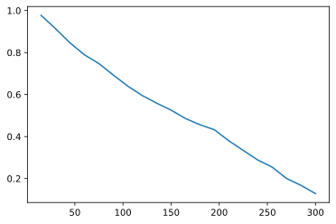

# Basic Usage:
In this notebook you will find:
- How to get a survival curve and neighbors prediction using xgbse
- How to validate your xgbse model using sklearn

## Metrabic

We will be using the Molecular Taxonomy of Breast Cancer International Consortium (METABRIC) dataset from [pycox](https://github.com/havakv/pycox#datasets) as base for this example.


```python
from xgbse.converters import convert_to_structured
from pycox.datasets import metabric
import numpy as np

# getting data
df = metabric.read_df()

df.head()
```


<div>
<style scoped>
    .dataframe tbody tr th:only-of-type {
        vertical-align: middle;
    }

    .dataframe tbody tr th {
        vertical-align: top;
    }

    .dataframe thead th {
        text-align: right;
    }
</style>
<table border="1" class="dataframe">
  <thead>
    <tr style="text-align: right;">
      <th></th>
      <th>x0</th>
      <th>x1</th>
      <th>x2</th>
      <th>x3</th>
      <th>x4</th>
      <th>x5</th>
      <th>x6</th>
      <th>x7</th>
      <th>x8</th>
      <th>duration</th>
      <th>event</th>
    </tr>
  </thead>
  <tbody>
    <tr>
      <th>0</th>
      <td>5.603834</td>
      <td>7.811392</td>
      <td>10.797988</td>
      <td>5.967607</td>
      <td>1.0</td>
      <td>1.0</td>
      <td>0.0</td>
      <td>1.0</td>
      <td>56.840000</td>
      <td>99.333336</td>
      <td>0</td>
    </tr>
    <tr>
      <th>1</th>
      <td>5.284882</td>
      <td>9.581043</td>
      <td>10.204620</td>
      <td>5.664970</td>
      <td>1.0</td>
      <td>0.0</td>
      <td>0.0</td>
      <td>1.0</td>
      <td>85.940002</td>
      <td>95.733330</td>
      <td>1</td>
    </tr>
    <tr>
      <th>2</th>
      <td>5.920251</td>
      <td>6.776564</td>
      <td>12.431715</td>
      <td>5.873857</td>
      <td>0.0</td>
      <td>1.0</td>
      <td>0.0</td>
      <td>1.0</td>
      <td>48.439999</td>
      <td>140.233337</td>
      <td>0</td>
    </tr>
    <tr>
      <th>3</th>
      <td>6.654017</td>
      <td>5.341846</td>
      <td>8.646379</td>
      <td>5.655888</td>
      <td>0.0</td>
      <td>0.0</td>
      <td>0.0</td>
      <td>0.0</td>
      <td>66.910004</td>
      <td>239.300003</td>
      <td>0</td>
    </tr>
    <tr>
      <th>4</th>
      <td>5.456747</td>
      <td>5.339741</td>
      <td>10.555724</td>
      <td>6.008429</td>
      <td>1.0</td>
      <td>0.0</td>
      <td>0.0</td>
      <td>1.0</td>
      <td>67.849998</td>
      <td>56.933334</td>
      <td>1</td>
    </tr>
  </tbody>
</table>
</div>


## Split and Time Bins

Split the data in train and test, using sklearn API. We also setup the TIME_BINS array, which will be used to fit the survival curve


```python
from xgbse.converters import convert_to_structured
from sklearn.model_selection import train_test_split

# splitting to X, T, E format
X = df.drop(['duration', 'event'], axis=1)
T = df['duration']
E = df['event']
y = convert_to_structured(T, E)

# splitting between train, and validation
X_train, X_test, y_train, y_test = train_test_split(X, y, test_size=1/3, random_state = 0)
TIME_BINS = np.arange(15, 315, 15)
TIME_BINS
```


    array([ 15,  30,  45,  60,  75,  90, 105, 120, 135, 150, 165, 180, 195,
           210, 225, 240, 255, 270, 285, 300])


## Fit and Predict

We will be using the DebiasedBCE estimator to fit the model and predict a survival curve for each point in our test data


```python
from xgbse import XGBSEDebiasedBCE

# fitting xgbse model
xgbse_model = XGBSEDebiasedBCE()
xgbse_model.fit(X_train, y_train, time_bins=TIME_BINS)

# predicting
y_pred = xgbse_model.predict(X_test)

print(y_pred.shape)
y_pred.head()
```

    (635, 20)


<div>
<style scoped>
    .dataframe tbody tr th:only-of-type {
        vertical-align: middle;
    }

    .dataframe tbody tr th {
        vertical-align: top;
    }

    .dataframe thead th {
        text-align: right;
    }
</style>
<table border="1" class="dataframe">
  <thead>
    <tr style="text-align: right;">
      <th></th>
      <th>15</th>
      <th>30</th>
      <th>45</th>
      <th>60</th>
      <th>75</th>
      <th>90</th>
      <th>105</th>
      <th>120</th>
      <th>135</th>
      <th>150</th>
      <th>165</th>
      <th>180</th>
      <th>195</th>
      <th>210</th>
      <th>225</th>
      <th>240</th>
      <th>255</th>
      <th>270</th>
      <th>285</th>
      <th>300</th>
    </tr>
  </thead>
  <tbody>
    <tr>
      <th>0</th>
      <td>0.983502</td>
      <td>0.951852</td>
      <td>0.923277</td>
      <td>0.900028</td>
      <td>0.862270</td>
      <td>0.799324</td>
      <td>0.715860</td>
      <td>0.687257</td>
      <td>0.651314</td>
      <td>0.610916</td>
      <td>0.568001</td>
      <td>0.513172</td>
      <td>0.493194</td>
      <td>0.430701</td>
      <td>0.377675</td>
      <td>0.310496</td>
      <td>0.272169</td>
      <td>0.225599</td>
      <td>0.184878</td>
      <td>0.144089</td>
    </tr>
    <tr>
      <th>1</th>
      <td>0.973506</td>
      <td>0.917739</td>
      <td>0.839154</td>
      <td>0.710431</td>
      <td>0.663119</td>
      <td>0.558886</td>
      <td>0.495204</td>
      <td>0.364995</td>
      <td>0.311628</td>
      <td>0.299939</td>
      <td>0.226226</td>
      <td>0.191373</td>
      <td>0.171697</td>
      <td>0.144864</td>
      <td>0.112447</td>
      <td>0.089558</td>
      <td>0.081137</td>
      <td>0.057679</td>
      <td>0.048563</td>
      <td>0.035985</td>
    </tr>
    <tr>
      <th>2</th>
      <td>0.986894</td>
      <td>0.959209</td>
      <td>0.919768</td>
      <td>0.889910</td>
      <td>0.853239</td>
      <td>0.777208</td>
      <td>0.725381</td>
      <td>0.649177</td>
      <td>0.582569</td>
      <td>0.531787</td>
      <td>0.485275</td>
      <td>0.451667</td>
      <td>0.428899</td>
      <td>0.386413</td>
      <td>0.344369</td>
      <td>0.279685</td>
      <td>0.242064</td>
      <td>0.187967</td>
      <td>0.158121</td>
      <td>0.118562</td>
    </tr>
    <tr>
      <th>3</th>
      <td>0.986753</td>
      <td>0.955210</td>
      <td>0.910354</td>
      <td>0.857684</td>
      <td>0.824301</td>
      <td>0.769262</td>
      <td>0.665805</td>
      <td>0.624934</td>
      <td>0.583592</td>
      <td>0.537261</td>
      <td>0.493957</td>
      <td>0.443193</td>
      <td>0.416702</td>
      <td>0.376552</td>
      <td>0.308947</td>
      <td>0.237033</td>
      <td>0.177140</td>
      <td>0.141838</td>
      <td>0.117917</td>
      <td>0.088937</td>
    </tr>
    <tr>
      <th>4</th>
      <td>0.977348</td>
      <td>0.940368</td>
      <td>0.873695</td>
      <td>0.804796</td>
      <td>0.742655</td>
      <td>0.632426</td>
      <td>0.556008</td>
      <td>0.521490</td>
      <td>0.493577</td>
      <td>0.458477</td>
      <td>0.416363</td>
      <td>0.391099</td>
      <td>0.364431</td>
      <td>0.291472</td>
      <td>0.223758</td>
      <td>0.190398</td>
      <td>0.165911</td>
      <td>0.120061</td>
      <td>0.095512</td>
      <td>0.069566</td>
    </tr>
  </tbody>
</table>
</div>


mean predicted survival curve for test data


```python
y_pred.mean().plot.line();
```





## Neighbors

We can also use our model for querying comparables based on survivability.


```python
neighbors = xgbse_model.get_neighbors(
    query_data = X_test,
    index_data = X_train,
    n_neighbors = 5
)

print(neighbors.shape)
neighbors.head(5)
```

    (635, 5)


<div>
<style scoped>
    .dataframe tbody tr th:only-of-type {
        vertical-align: middle;
    }

    .dataframe tbody tr th {
        vertical-align: top;
    }

    .dataframe thead th {
        text-align: right;
    }
</style>
<table border="1" class="dataframe">
  <thead>
    <tr style="text-align: right;">
      <th></th>
      <th>neighbor_1</th>
      <th>neighbor_2</th>
      <th>neighbor_3</th>
      <th>neighbor_4</th>
      <th>neighbor_5</th>
    </tr>
  </thead>
  <tbody>
    <tr>
      <th>829</th>
      <td>339</td>
      <td>166</td>
      <td>508</td>
      <td>1879</td>
      <td>418</td>
    </tr>
    <tr>
      <th>670</th>
      <td>1846</td>
      <td>1082</td>
      <td>1297</td>
      <td>194</td>
      <td>1448</td>
    </tr>
    <tr>
      <th>1064</th>
      <td>416</td>
      <td>1230</td>
      <td>739</td>
      <td>1392</td>
      <td>589</td>
    </tr>
    <tr>
      <th>85</th>
      <td>1558</td>
      <td>8</td>
      <td>1080</td>
      <td>613</td>
      <td>1522</td>
    </tr>
    <tr>
      <th>1814</th>
      <td>105</td>
      <td>859</td>
      <td>1743</td>
      <td>50</td>
      <td>566</td>
    </tr>
  </tbody>
</table>
</div>


<b>example</b>: selecting a data point from query data (X_test) and checking its features


```python
desired = neighbors.iloc[10]

X_test.loc[X_test.index == desired.name]
```


<div>
<style scoped>
    .dataframe tbody tr th:only-of-type {
        vertical-align: middle;
    }

    .dataframe tbody tr th {
        vertical-align: top;
    }

    .dataframe thead th {
        text-align: right;
    }
</style>
<table border="1" class="dataframe">
  <thead>
    <tr style="text-align: right;">
      <th></th>
      <th>x0</th>
      <th>x1</th>
      <th>x2</th>
      <th>x3</th>
      <th>x4</th>
      <th>x5</th>
      <th>x6</th>
      <th>x7</th>
      <th>x8</th>
    </tr>
  </thead>
  <tbody>
    <tr>
      <th>399</th>
      <td>5.572504</td>
      <td>7.367552</td>
      <td>11.023443</td>
      <td>5.406307</td>
      <td>1.0</td>
      <td>0.0</td>
      <td>0.0</td>
      <td>1.0</td>
      <td>67.620003</td>
    </tr>
  </tbody>
</table>
</div>


... and finding its comparables from index data (X_train)


```python
X_train.loc[X_train.index.isin(desired.tolist())]
```


<div>
<style scoped>
    .dataframe tbody tr th:only-of-type {
        vertical-align: middle;
    }

    .dataframe tbody tr th {
        vertical-align: top;
    }

    .dataframe thead th {
        text-align: right;
    }
</style>
<table border="1" class="dataframe">
  <thead>
    <tr style="text-align: right;">
      <th></th>
      <th>x0</th>
      <th>x1</th>
      <th>x2</th>
      <th>x3</th>
      <th>x4</th>
      <th>x5</th>
      <th>x6</th>
      <th>x7</th>
      <th>x8</th>
    </tr>
  </thead>
  <tbody>
    <tr>
      <th>757</th>
      <td>5.745395</td>
      <td>8.178815</td>
      <td>10.745699</td>
      <td>5.530381</td>
      <td>1.0</td>
      <td>1.0</td>
      <td>0.0</td>
      <td>1.0</td>
      <td>64.930000</td>
    </tr>
    <tr>
      <th>726</th>
      <td>5.635854</td>
      <td>6.648942</td>
      <td>10.889588</td>
      <td>5.496374</td>
      <td>1.0</td>
      <td>1.0</td>
      <td>0.0</td>
      <td>1.0</td>
      <td>70.860001</td>
    </tr>
    <tr>
      <th>968</th>
      <td>5.541239</td>
      <td>7.058089</td>
      <td>10.463409</td>
      <td>5.396433</td>
      <td>1.0</td>
      <td>0.0</td>
      <td>0.0</td>
      <td>1.0</td>
      <td>71.070000</td>
    </tr>
    <tr>
      <th>870</th>
      <td>5.605712</td>
      <td>7.309217</td>
      <td>10.935708</td>
      <td>5.542732</td>
      <td>0.0</td>
      <td>1.0</td>
      <td>0.0</td>
      <td>1.0</td>
      <td>71.470001</td>
    </tr>
    <tr>
      <th>1640</th>
      <td>5.812605</td>
      <td>7.646811</td>
      <td>10.952687</td>
      <td>5.516386</td>
      <td>1.0</td>
      <td>1.0</td>
      <td>0.0</td>
      <td>1.0</td>
      <td>68.559998</td>
    </tr>
  </tbody>
</table>
</div>


## Score metrics

XGBSE implements concordance index and integrated brier score, both can be used to evaluate model performance


```python
# importing metrics
from xgbse.metrics import concordance_index, approx_brier_score

# running metrics
print(f"C-index: {concordance_index(y_test, y_pred)}")
print(f"Avg. Brier Score: {approx_brier_score(y_test, y_pred)}")
```

    C-index: 0.6706453426714781
    Avg. Brier Score: 0.17221909077845754


## Cross Validation

We can also use sklearn's cross_val_score and make_scorer to cross validate our model


```python
from sklearn.model_selection import cross_val_score
from sklearn.metrics import make_scorer

results = cross_val_score(xgbse_model, X, y, scoring=make_scorer(approx_brier_score))
results
```


    array([0.16269636, 0.14880423, 0.12848939, 0.15335356, 0.15394174])
