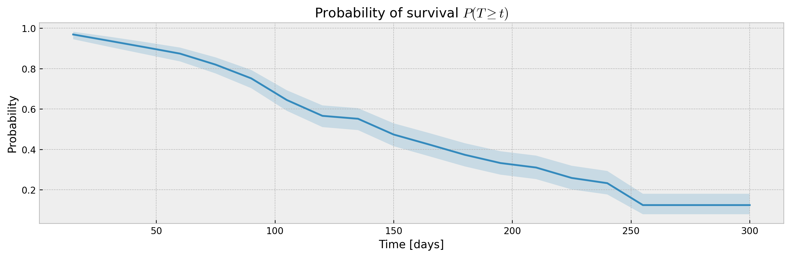

# Confidence Interval:
In this notebook you will find:
- Get confidence intervals for predicted survival curves using XGBSE estimators;
- How to use XGBSEBootstrapEstimator, a meta estimator for bagging;
- A nice function to help us plot survival curves.


```python
import matplotlib.pyplot as plt
plt.style.use('bmh')

from IPython.display import set_matplotlib_formats
set_matplotlib_formats('retina')

# to easily plot confidence intervals
def plot_ci(mean, upper_ci, lower_ci, i=42, title='Probability of survival $P(T \geq t)$'):

    # plotting mean and confidence intervals
    plt.figure(figsize=(12, 4), dpi=120)
    plt.plot(mean.columns,mean.iloc[i])
    plt.fill_between(mean.columns, lower_ci.iloc[i], upper_ci.iloc[i], alpha=0.2)

    plt.title(title)
    plt.xlabel('Time [days]')
    plt.ylabel('Probability')
    plt.tight_layout()

```

## Metrabic

We will be using the Molecular Taxonomy of Breast Cancer International Consortium (METABRIC) dataset from [pycox](https://github.com/havakv/pycox#datasets) as base for this example.


```python
from xgbse.converters import convert_to_structured
from pycox.datasets import metabric
import numpy as np

# getting data
df = metabric.read_df()

df.head()
```


<div>
<style scoped>
    .dataframe tbody tr th:only-of-type {
        vertical-align: middle;
    }

    .dataframe tbody tr th {
        vertical-align: top;
    }

    .dataframe thead th {
        text-align: right;
    }
</style>
<table border="1" class="dataframe">
  <thead>
    <tr style="text-align: right;">
      <th></th>
      <th>x0</th>
      <th>x1</th>
      <th>x2</th>
      <th>x3</th>
      <th>x4</th>
      <th>x5</th>
      <th>x6</th>
      <th>x7</th>
      <th>x8</th>
      <th>duration</th>
      <th>event</th>
    </tr>
  </thead>
  <tbody>
    <tr>
      <th>0</th>
      <td>5.603834</td>
      <td>7.811392</td>
      <td>10.797988</td>
      <td>5.967607</td>
      <td>1.0</td>
      <td>1.0</td>
      <td>0.0</td>
      <td>1.0</td>
      <td>56.840000</td>
      <td>99.333336</td>
      <td>0</td>
    </tr>
    <tr>
      <th>1</th>
      <td>5.284882</td>
      <td>9.581043</td>
      <td>10.204620</td>
      <td>5.664970</td>
      <td>1.0</td>
      <td>0.0</td>
      <td>0.0</td>
      <td>1.0</td>
      <td>85.940002</td>
      <td>95.733330</td>
      <td>1</td>
    </tr>
    <tr>
      <th>2</th>
      <td>5.920251</td>
      <td>6.776564</td>
      <td>12.431715</td>
      <td>5.873857</td>
      <td>0.0</td>
      <td>1.0</td>
      <td>0.0</td>
      <td>1.0</td>
      <td>48.439999</td>
      <td>140.233337</td>
      <td>0</td>
    </tr>
    <tr>
      <th>3</th>
      <td>6.654017</td>
      <td>5.341846</td>
      <td>8.646379</td>
      <td>5.655888</td>
      <td>0.0</td>
      <td>0.0</td>
      <td>0.0</td>
      <td>0.0</td>
      <td>66.910004</td>
      <td>239.300003</td>
      <td>0</td>
    </tr>
    <tr>
      <th>4</th>
      <td>5.456747</td>
      <td>5.339741</td>
      <td>10.555724</td>
      <td>6.008429</td>
      <td>1.0</td>
      <td>0.0</td>
      <td>0.0</td>
      <td>1.0</td>
      <td>67.849998</td>
      <td>56.933334</td>
      <td>1</td>
    </tr>
  </tbody>
</table>
</div>


## Split and Time Bins

Split the data in train and test, using sklearn API. We also setup the TIME_BINS array, which will be used to fit the survival curve.


```python
from xgbse.converters import convert_to_structured
from sklearn.model_selection import train_test_split

# splitting to X, T, E format
X = df.drop(['duration', 'event'], axis=1)
T = df['duration']
E = df['event']
y = convert_to_structured(T, E)

# splitting between train, and validation
X_train, X_test, y_train, y_test = train_test_split(X, y, test_size=1/3, random_state = 0)
TIME_BINS = np.arange(15, 315, 15)
TIME_BINS
```


    array([ 15,  30,  45,  60,  75,  90, 105, 120, 135, 150, 165, 180, 195,
           210, 225, 240, 255, 270, 285, 300])


## Calculating confidence intervals

We will be using the XGBSEKaplanTree estimator to fit the model and predict a survival curve for each point in our test data, and via <i>return_ci</i> parameter we will get upper and lower bounds for the confidence interval.


```python
from xgbse import XGBSEKaplanTree, XGBSEBootstrapEstimator
from xgbse.metrics import concordance_index, approx_brier_score

# xgboost parameters to fit our model
PARAMS_TREE = {
    'objective': 'survival:cox',
    'eval_metric': 'cox-nloglik',
    'tree_method': 'hist',
    'max_depth': 10,
    'booster':'dart',
    'subsample': 1.0,
    'min_child_weight': 50,
    'colsample_bynode': 1.0
}
```

### Numerical Form

The KaplanTree and KaplanNeighbors models support estimation of confidence intervals via the Exponential Greenwood formula.


```python
%%time

# fitting xgbse model
xgbse_model = XGBSEKaplanTree(PARAMS_TREE)
xgbse_model.fit(X_train, y_train, time_bins=TIME_BINS)

# predicting
mean, upper_ci, lower_ci = xgbse_model.predict(X_test, return_ci=True)

# print metrics
print(f"C-index: {concordance_index(y_test, mean)}")
print(f"Avg. Brier Score: {approx_brier_score(y_test, mean)}")

# plotting CIs
plot_ci(mean, upper_ci, lower_ci)
```

    C-index: 0.6358942056527093
    Avg. Brier Score: 0.182841148106733
    CPU times: user 1.88 s, sys: 9.37 ms, total: 1.88 s
    Wall time: 897 ms





### Non-parametric Form

We can also use the XGBSEBootstrapEstimator to wrap any XGBSE model and get confidence intervals via bagging, which also slighty increase our performance at the cost of computation time.


```python
%%time

# base model as XGBSEKaplanTree
base_model = XGBSEKaplanTree(PARAMS_TREE)

# bootstrap meta estimator
bootstrap_estimator = XGBSEBootstrapEstimator(base_model, n_estimators=100)

# fitting the meta estimator
bootstrap_estimator.fit(X_train, y_train, time_bins=TIME_BINS)

# predicting
mean, upper_ci, lower_ci = bootstrap_estimator.predict(X_test, return_ci=True)

# print metrics
print(f"C-index: {concordance_index(y_test, mean)}")
print(f"Avg. Brier Score: {approx_brier_score(y_test, mean)}")

# plotting CIs
plot_ci(mean, upper_ci, lower_ci)
```

    C-index: 0.6580651819585904
    Avg. Brier Score: 0.17040560738276272
    CPU times: user 17.3 s, sys: 58.5 ms, total: 17.4 s
    Wall time: 4.18 s


```python

```


```python

```
