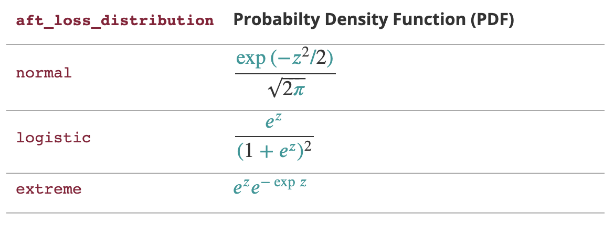
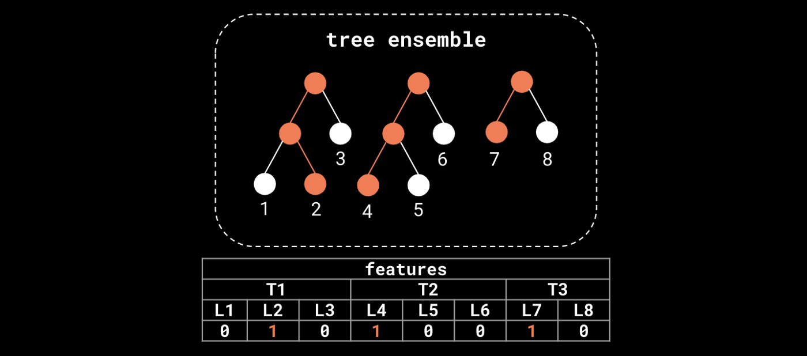

---
hide:
  - navigation
---

In this section, we try to make a quick introduction to `xgbse`. Refer to this [this Notebook](https://github.com/loft-br/xgboost-survival-embeddings/blob/main/examples/how_xgbse_works.ipynb) for the full code and/or if you want a more practical introduction.

### *What `xgbse` tries to solve*

The XGBoost implementation provides two methods for survival analysis: [Cox](https://forecast.global/insight/underrated-in-ml-intro-to-survival-analysis/) and [Accelerated Failure Time (AFT)](https://xgboost.readthedocs.io/en/latest/tutorials/aft_survival_analysis.html). When it comes to ordering individuals by risk, both show competitive performance (as measured by C-index, the ROC AUC equivalent for survival) while being lightning fast.

However, we can observe shortcomings when it comes to other desirable statistical properties. Specifically, three properties are of concern:

* prediction of **survival curves** rather than **point estimates**
* estimation of **confidence intervals**
* **calibrated** (unbiased) expected survival times

Let us take the AFT implementation as an example (as Cox only outputs risk and not time or survival). The AFT model outputs a value that should be interpreted as the expected survival time for each sample. To compute this time, it assumes an underlying distribution for times and events, controlled by the `aft_loss_distribution` and `aft_loss_distribution_scale` hyperparameters. As they control hard-wired assumptions of the model, we would expect that they could drastically change its output.

<center>
    
    <br>
    <sub>Table explaining the impact of `aft_loss_distribution` and `aft_loss_distribution_scale`, the latter represented by the $z$ variable in the formulas. Source: XGBoost AFT documentation.</sub>
</center>

To confirm this is true, let us perform an experiment using the METABRIC dataset. We will test different values for `aft_loss_distribution_scale` while keeping `aft_loss_distribution` as `"normal"` and check how this will affect model performance. We test the following values: `[0.5, 1.0, 1.5]`. The following snippet gives a rough idea on how to run this simple experiment but you can find the full code [here](https://github.com/loft-br/xgboost-survival-embeddings/blob/main/examples/how_xgbse_works.ipynb). The results are very interesting, if not alarming:

```python
import xgboost as xgb
from xgbse.metrics import concordance_index
from xgbse._kaplan_neighbors import DEFAULT_PARAMS

# dummy function representing dataprep
dtrain, dval = prepare_data()

# loop to show different scale results
for scale in [1.5, 1.0, 0.5]:

    # chaning parameter
    DEFAULT_PARAMS['aft_loss_distribution_scale'] = scale

    # training model
    bst = xgb.train(
        DEFAULT_PARAMS,
        dtrain,
        num_boost_round=1000,
        early_stopping_rounds=10,
        evals=[(dval, 'val')],
        verbose_eval=0
    )

    # predicting and evaluating
    preds = bst.predict(dval)
    cind = concordance_index(y_valid, -preds, risk_strategy="precomputed")

    print(f"aft_loss_distribution_scale: {scale}")
    print(f"C-index: {cind:.3f}")
    print(f"Average survival time: {preds.mean():.0f} days")
    print("----")
```

```
aft_loss_distribution_scale: 1.5
C-index: 0.645
Average survival time: 203 days
----
aft_loss_distribution_scale: 1.0
C-index: 0.648
Average survival time: 165 days
----
aft_loss_distribution_scale: 0.5
C-index: 0.646
Average survival time: 125 days
----
```

In all three scenarios, we can build models with C-index results close to the state of the art [8]. However, our predictions change drastically, with two models showing an average predicted survival time difference of 78 days. This difference would perhaps be understandable if we were analyzing a single sample. But we're looking across the full validation dataset where the average prediction should be fairly stable regardless of which model we use.

If we plot these results alongside an unbiased survival estimator such as the Kaplan Meier we can check that for each step of `0.5` in `aft_loss_distribution_scale` we move roughly one decile to the right in the curve. Also, we don't see a full survival curve: XGBoost only outputs point time-to-event predictions (no confidence intervals either).

<center>
    
    <br>
    <sub>Vanilla XGBoost outputs predictions that are overly sensitive to hyperparameters, which prevents its use on applications that are sensitive to survival curve calibration.</sub>
</center>

So what predictions should we trust? Such sensitivity to hyperparameters (`0.003` C-index variation yet 78 days difference) raises red flags for applications that are dependent on robust and calibrated time-to-event estimates, mining trust and preventing shipping survival analysis models to production.

### *Leveraging `xgboost` as a feature transformer*

Although in need of an extension for statistical rigor, `xgboost` is still a powerhouse. C-index results show that the model can capture a great deal of signal, being competitive with the state of the art. We just need to adapt how we use it.

Besides being leveraged for prediction tasks, Gradient Boosted Trees (GBTs) can also be used as ***feature transformers*** of the input data. Trees in the ensemble perform splits on features that discriminate the target, encoding the most relevant information for the task at hand in their structure. In particular, the terminal nodes (leaves) at each tree in the ensemble define a ***[feature transformation](http://scikit-learn.org/stable/auto_examples/ensemble/plot_feature_transformation.html) (embedding)*** of the input data.


<center>
    
    <br>
    <sub>We can extract features from a forest model like XGBoost, transforming the original feature space into a "leaf occurrence" embedding. Orange nodes represent the path of a single sample in the ensemble.
</sub>
</center>

This kind of *tree ensemble embedding* has very convenient properties:

1. **sparsity and high-dimensionality:** trees deal with nonlinearity and cast original features to a sparse, high-dimensional embedding, which helps linear models perform well when trained on it. This allows a **Logistic Regression** trained on the embedding (as one-hot encoded leaf indices) to have comparable performance to the actual ensemble, with the added benefit of probability calibration (see [1], [2], and [3])

2. **supervision:** trees also work as a noise filter, performing splits only through features that have predictive power. Thus, the embedding actually has a lower intrinsic dimension than the input data. This mitigates the curse of dimensionality and allows a **K-Nearest Neighbor** model trained on the embedding (using hamming distance) to have comparable performance to the actual ensemble, with the added flexibility to apply any function over the neighbor-sets to get predictions. This arbitrary function can be, for instance, an unbiased survival estimator such as the Kaplan-Meier estimator (see [4])

We take advantage of these properties in different ways as we will show in the next subsections.

### *`XGBSEDebiasedBCE`: logistic regressions, time windows, embedding as input*

Our first approach, `XGBSEDebiasedBCE`, takes inspiration from the multi-task logistic regression method in [5], the BCE approach in [6], and the probability calibration ideas from [1], [2] and [3].

It consists of training a set of logistic regressions on top of the embedding produced by `xgboost`, each predicting survival at different user-defined discrete time windows. The classifiers remove individuals as they are censored, with targets that are indicators of surviving at each window.


The naive approach tends to give biased survival curves, due to the removal of censored individuals. Thus, we made some adaptations such that logistic regressions estimate the `di/ni` term (point probabilities) in the [Kaplan-Meier formula](https://www.math.wustl.edu/~sawyer/handouts/greenwood.pdf) and then use the KM estimator to get nearly unbiased survival curves.

This way, we can get full survival curves from `xgboost`, and confidence intervals with minor adaptations (such as performing some rounds of bootstrap).

Training and scoring of logistic regression models is efficient, being performed in parallel through `joblib`, so the model can scale to hundreds of thousands or millions of samples.

### *`XGBSEStackedWeibull`: XGBoost as risk estimator, Weibull AFT for survival curve*

In `XGBSEStackedWeibull`, we perform stacking of a XGBoost survival model with a Weibull AFT parametric model. The XGBoost fits the data and then predicts a value that is interpreted as a risk metric. This risk metric is fed to the Weibull regression which uses it as its only independent variable.

Thus, we can get the benefit of XGBoost discrimination power alongside the Weibull AFT statistical rigor (e.g. calibrated survival curves).


As we're stacking XGBoost with a single, one-variable parametric model (as opposed to `XGBSEDebiasedBCE`), the model can be much faster (especially in training). We also have better extrapolation capabilities, due to stronger assumptions about the shape of the survival curve.

However, these stronger assumptions may not fit some datasets as well as other methods.

### *`XGBSEKaplanNeighbors`: Kaplan-Meier on nearest neighbors*

As explained in the previous section, even though the embedding produced by `xgboost` is sparse and high dimensional, its intrisic dimensionality actually should be lower than the input data. This enables us to "convert" `xgboost` into a nearest neighbor model, where we use hamming distance to define similar elements as the ones that co-occurred the most at the ensemble terminal nodes. Then, at each neighbor-set we can get survival estimates with robust methods such as the Kaplan-Meier estimator.


We recommend using `dart` as the booster to prevent any tree to dominate variance in the ensemble and break the leaf co-ocurrence similarity logic. We built a high-performing implementation of the KM estimator to calculate several survival curves in a vectorized fashion, including upper and lower confidence intervals based on the Exponential Greenwood formula.

However, this method can be very expensive at scales of hundreds of thousands of samples, due to the nearest neighbor search, both on training (construction of search index) and scoring (actual search).

### *`XGBSEKaplanTree`: single tree, and Kaplan-Meier on its leaves*

As a simplification to `XGBSEKaplanNeighbors`, we also provide a single tree implementation. Instead of doing expensive nearest neighbor searches, we fit a single tree via `xgboost` and calculate KM curves at each of its leaves.


It is by far the most efficient implementation, able to scale to millions of examples easily. At fit time, the tree is built and all KM curves are pre-calculated, so that at scoring time a simple query will suffice to get the model's estimates.

However, as we're fitting a single tree, predictive power may be worse. That could be a sensible tradeoff, but we also provide `XGBSEBootstrapEstimator`, a bootstrap abstraction where we can fit a forest of `XGBSEKaplanTree`'s to improve accuracy and reduce variance.

### *Does it solve the problem?*

Now we return to the first example and check how `XGBEmbedKaplanNeighbors` performs:

```python
# importing xgbse
from xgbse import XGBSEKaplanNeighbors
from xgbse._kaplan_neighbors import DEFAULT_PARAMS
from xgbse.metrics import concordance_index

# dummy function representing dataprep
dtrain, dval = prepare_data()

# loop to show different scale results
for scale in [1.5, 1.0, 0.5]:

    # chaning parameter
    DEFAULT_PARAMS['aft_loss_distribution_scale'] = scale

    # training model
    xgbse_model = XGBSEKaplanNeighbors(DEFAULT_PARAMS, n_neighbors=30)
    xgbse_model.fit(
        X_train, y_train,
        validation_data = (X_valid, y_valid),
        early_stopping_rounds=10,
        time_bins=TIME_BINS
    )

    # predicting and evaluating
    preds = xgbse_model.predict(X_valid)
    cind = concordance_index(y_valid, preds)
    avg_probs = preds[[30, 90, 150]].mean().values.round(4).tolist()

    print(f"aft_loss_distribution_scale: {scale}")
    print(f"C-index: {cind:.3f}")
    print(f"Average probability of survival at [30, 90, 150] days: {avg_probs}")
    print("----")
```

```
aft_loss_distribution_scale: 1.5
C-index: 0.640
Average probability of survival at [30, 90, 150] days: [0.9109, 0.6854, 0.528]
----
aft_loss_distribution_scale: 1.0
C-index: 0.644
Average probability of survival at [30, 90, 150] days: [0.9111, 0.6889, 0.5333]
----
aft_loss_distribution_scale: 0.5
C-index: 0.650
Average probability of survival at [30, 90, 150] days: [0.913, 0.6904, 0.5289]
----
```

As measured by the average probability of survival in 30, 90 and 150 days the model is very stable, showing similar calibration results independently of `aft_loss_distribution_scale` choice, with comparable (or a bit worse) C-index results. Visually, the comparison of the average model predictions to a Kaplan Meier yields much better results:

<center>
    
    <br>
    <sub>XGBSE outputs a full survival curve and it is much more stable than vanilla XGBoost, its average prediction being fairly close to the unbiased KM estimator. </sub>
</center>

No more point estimates and high variation! Although is too harsh to claim that the problem is solved, we believe that the package can be a good, more statistically robust alternative to survival analysis.


### *References*

[1] X. He, J. Pan, O. Jin, T. Xu, B. Liu, T. Xu, Y. Shi, A. Atallah, R. Herbrich, S. Bowers, and J. Q. Candela. [Practical Lessons from Predicting Clicks on Ads at Facebook](https://research.fb.com/wp-content/uploads/2016/11/practical-lessons-from-predicting-clicks-on-ads-at-facebook.pdf) (2014). In Proceedings of the Eighth International Workshop on Data Mining for Online Advertising (ADKDD’14).

[2] [Feature transformations with ensembles of trees](https://scikit-learn.org/stable/auto_examples/ensemble/plot_feature_transformation.html). Scikit-learn documentation at <https://scikit-learn.org/>.

[3] G. Marmerola. [Calibration of probabilities for tree-based models](https://gdmarmerola.github.io/probability-calibration/). Personal Blog at <https://gdmarmerola.github.io/>.

[4] G. Marmerola. [Supervised dimensionality reduction and clustering at scale with RFs with UMAP](https://gdmarmerola.github.io/umap-supervised-embeddings/). Personal Blog at <https://gdmarmerola.github.io/>.

[5] C. Yu, R. Greiner, H. Lin, V. Baracos. [Learning Patient-Specific Cancer Survival Distributions as a Sequence of Dependent Regressors](http://www.cs.cornell.edu/~cnyu/papers/nips11_survival.pdf). Advances in Neural Information Processing Systems 24 (NIPS 2011).

[6] H. Kvamme, Ø. Borgan. [The Brier Score under Administrative Censoring: Problems and Solutions](https://arxiv.org/pdf/1912.08581.pdf). arXiv preprint arXiv:1912.08581.

[7] S. Sawyer. [The Greenwood and Exponential Greenwood Confidence Intervals in Survival Analysis](https://www.math.wustl.edu/~sawyer/handouts/greenwood.pdf). Handout on Washington University in St. Louis website.

[8] H. Kvamme, Ø. Borgan, and I. Scheel. [Time-to-event prediction with neural networks and Cox regression](https://jmlr.org/papers/v20/18-424.html). Journal of Machine Learning Research, 20(129):1–30, 2019.

[9] H. Haider, B. Hoehn, S. Davis, R. Greiner. [Effective Ways to Build and Evaluate Individual Survival Distributions](https://arxiv.org/pdf/1811.11347.pdf). Journal of Machine Learning Research 21 (2020) 1–63.